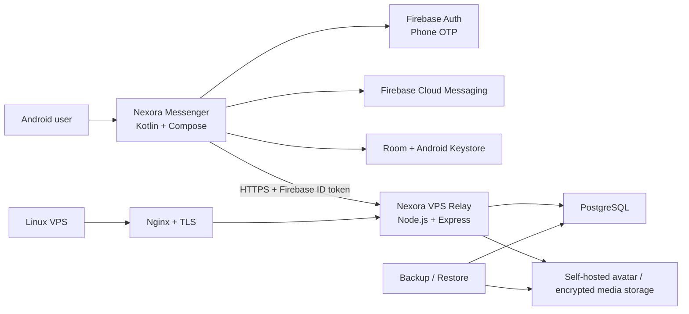

<div align="center">

# Nexora Messenger

### Private, self-hosted Android messaging infrastructure

A native Android messaging project focused on client-side encrypted payloads, local-first application state, phone authentication, push notifications, and a self-hosted relay/backend.

[](https://github.com/Gh0stDeveloper/Nexora-Messenger/actions/workflows/ci.yml)
[](https://github.com/Gh0stDeveloper/Nexora-Messenger/actions/workflows/android-release.yml)


[Architecture](docs/ARCHITECTURE.md) · [Security](docs/SECURITY.md) · [Implemented Roadmap](docs/ROADMAP_IMPLEMENTED_PHASES.md) · [VPS Deployment](backend/VPS_DEPLOYMENT.md)

</div>

---

## Overview

**Nexora Messenger** is a native Android messaging application for the Nexora ecosystem.

The project combines a Kotlin/Jetpack Compose client with a self-hosted Node.js/PostgreSQL relay. Core messaging data is designed around local persistence and encrypted payload transport instead of depending on hosted application databases such as Supabase or hosted object storage for primary message state.

The current repository includes working Android, backend, Docker, CI, deployment, backup, and signed-release foundations.

## Current Capabilities

### Android application

- native **Kotlin + Jetpack Compose** UI;
- Android **API 26+**, targeting API 36;
- phone-number authentication through **Firebase Auth OTP**;
- Firebase Cloud Messaging token synchronization and notification handling;
- required user profile with server-hosted avatar;
- local persistence through **Room**;
- Android Keystore-backed local cryptographic material;
- chat list and chat detail flows;
- contacts foundation;
- groups foundation;
- ephemeral status/story data model;
- encrypted media-upload foundation;
- Messenger-style mobile UI;
- Mexico phone-number normalization;
- local/debug preview session for development.

### Messaging and crypto foundation

Message payloads are encrypted on Android before they are submitted to the relay.

The repository currently includes:

- local AES-GCM payload encryption;
- identity-key foundation;
- ratchet/session groundwork;
- encrypted payload storage on the backend;
- generic ciphertext-safe message previews;
- foundations for encrypted media.

> **Security status:** the current cryptographic layer is **not an audited Signal Protocol implementation**. Production-grade Signal-style E2EE still requires complete identity verification, signed/one-time prekeys, X3DH-style session establishment, Double Ratchet chains, skipped-message key handling, multi-device sessions, sender keys for groups, and independent security review.

This distinction is intentional: the project does not claim production-grade E2EE before those requirements are implemented and audited.

## Architecture



### Responsibility boundaries

| Layer | Responsibility |
| --- | --- |
| Android client | UI, local state, authentication session, payload encryption/decryption |
| Firebase Auth | Phone-number identity verification |
| Firebase Cloud Messaging | Push delivery signaling |
| Relay API | Authenticated message routing and server-side persistence |
| PostgreSQL | Users, chats, encrypted messages, contacts/groups/status data |
| Self-hosted storage | Avatars and encrypted media objects |
| Nginx | TLS termination and reverse proxy |
| Docker Compose | VPS service orchestration |

## Backend Security Model

Relay endpoints require a Firebase ID token:

```text
Authorization: Bearer FIREBASE_ID_TOKEN
```

The backend validates the authenticated identity before accepting relay operations. For message submission, it also verifies that the sender identity matches the authenticated user.

A simplified encrypted message payload looks like:

```json
{
  "senderId": "uid1",
  "recipientId": "uid2",
  "kind": "TEXT",
  "encryptedPayload": "base64",
  "iv": "base64",
  "messageId": "uuid",
  "timestamp": 1760000000000
}
```

The relay stores ciphertext and IV material rather than plaintext message content.

## Repository Structure

```text
android/                 Native Android application
backend/vps-api/         Node.js / Express relay API
backend/vps/             Docker Compose, Nginx and VPS scripts
backend/VPS_DEPLOYMENT.md
docs/                    Architecture, security and roadmap notes
.github/workflows/       CI, signed Android release and VPS deployment
README.md
```

## Technology Stack

| Layer | Technology |
| --- | --- |
| Android | Kotlin, Jetpack Compose, Material 3 |
| Local data | Room |
| Networking | Retrofit, OkHttp |
| Authentication | Firebase Auth |
| Notifications | Firebase Cloud Messaging |
| Backend | Node.js 22, Express |
| Database | PostgreSQL |
| Deployment | Docker Compose, Nginx, Linux VPS |
| CI/CD | GitHub Actions |
| Android toolchain | JDK 17, Gradle 8.10.2, Android SDK 36 |

## Build the Android App

### Requirements

- JDK 17
- Android SDK 36
- Gradle 8.10.2 or compatible project environment
- Firebase Android configuration
- reachable Nexora relay URL

Add your Firebase configuration at:

```text
android/app/google-services.json
```

Then build:

```bash
cd android
gradle :app:assembleDebug \
  -PNEXORA_RELAY_BASE_URL=https://api.example.com
```

For an Android emulator using a locally running relay:

```bash
gradle :app:assembleDebug \
  -PNEXORA_RELAY_BASE_URL=http://10.0.2.2:8080
```

## Self-Host the Relay

The backend is designed to run on a Linux VPS with Docker and Nginx.

```bash
sudo mkdir -p /opt/nexora
sudo chown -R "$USER":"$USER" /opt/nexora

rsync -az ./ /opt/nexora/
cd /opt/nexora/backend/vps

cp .env.example .env
nano .env

bash scripts/deploy.sh
```

Core environment variables include:

```env
POSTGRES_DB=nexora
POSTGRES_USER=nexora
POSTGRES_PASSWORD=replace_with_a_long_password
APP_PUBLIC_BASE_URL=https://api.example.com
FIREBASE_SERVICE_ACCOUNT_BASE64=base64_service_account
MAX_AVATAR_BYTES=2097152
MAX_CIPHERTEXT_BYTES=524288
BACKUP_ROOT=/opt/nexora/backups
```

See [backend/VPS_DEPLOYMENT.md](backend/VPS_DEPLOYMENT.md) for deployment details.

## Main Relay Endpoints

```text
GET  /health
GET  /ready
GET  /v1/relay/version

POST /v1/relay/users/me/bootstrap
POST /v1/relay/users/me/avatar
POST /v1/relay/users/me/fcm-token

POST /v1/relay/messages
GET  /v1/relay/chats
GET  /v1/relay/chats/:chatId/messages
```

The backend also contains the newer contacts, groups, status, and encrypted-media foundations documented in the implemented roadmap.

## Backup and Restore

Create a backup:

```bash
cd /opt/nexora/backend/vps
bash scripts/backup.sh
```

List available backups:

```bash
bash scripts/list-backups.sh
```

Restore one:

```bash
bash scripts/restore.sh /opt/nexora/backups/<backup-id>
```

Backups include PostgreSQL state, uploaded assets, an environment snapshot, a manifest, and SHA-256 checksums.

## CI/CD

### Continuous Integration

[CI](.github/workflows/ci.yml) validates:

- Node.js backend dependencies;
- backend syntax;
- Docker image build;
- Android debug compilation;
- APK artifact generation.

### Signed Android Releases

[Android Release](.github/workflows/android-release.yml) builds a signed release APK using repository secrets.

The Android release signing configuration enables:

- V1 signing;
- V2 signing;
- V3 signing;
- V4 signing.

Expected release secrets:

```text
GOOGLE_SERVICES_JSON_BASE64
NEXORA_KEYSTORE_BASE64
NEXORA_KEYSTORE_PASSWORD
NEXORA_KEY_ALIAS
NEXORA_KEY_PASSWORD
```

### VPS Deployment

[deploy-vps.yml](.github/workflows/deploy-vps.yml) provides the deployment workflow for the self-hosted relay environment.

## Security Roadmap

The highest-priority security work is completing the session/device E2EE design:

- identity-key verification;
- signed prekeys;
- one-time prekeys;
- X3DH-style session setup;
- Double Ratchet message chains;
- skipped-message key cache;
- multi-device sessions;
- sender keys for groups;
- independent protocol/security review.

Product work also continues around offline delivery semantics, acknowledgements, encrypted attachments, groups, status/stories, and release hardening.

## Documentation

- [Architecture](docs/ARCHITECTURE.md)
- [Security](docs/SECURITY.md)
- [Implemented Feature Batch](docs/ROADMAP_IMPLEMENTED_PHASES.md)
- [VPS Deployment](backend/VPS_DEPLOYMENT.md)

## Project Status

Nexora Messenger is under **active development**.

The repository is suitable for ongoing engineering, integration testing, UI development, backend deployment work, and security iteration. It should not yet be presented as an audited secure messenger or a complete Signal-equivalent implementation.

---

<div align="center">

**Nexora Messenger — native Android messaging with self-hosted infrastructure and explicit security boundaries.**

</div>
